# Monitor My Solar Home assistant integration
This solution was devloped to take over from where others have started, this integration only works with hardware purchased from us directly at https://monitormy.solar
This integration is designed to make adding your inverter to home assistant without the complexity of creating modbus solutions or other funky hardware the dongle is designed to plug in and replace your current dongle connected to your inverter
for some brands not others (listed below) you can use our dongle to communicate with the manufacturers portal as well as our own and home assistant. 
 - Lux Power

# What is this and what does it do? 
This integration is as simple as it sounds, connect the dongle get all the entites and sensors your inverter has to offer with read and write capabilities. 

## For issues please see the issues tab
- if there are settings missing you would like add these to the issue already raised we will add these and then update the list with the firmware that fixes these
- If there are settings issues please add a comment to the issue and we will add them to the list with a firmware response or HA version respons
- if there are integration issues please add these to the issue already open and we will add these to the list with the known fix
- if there is a issue that is worthy of its own issue the please raise a seperate issue with as much information as possible.
- If you have a dongle issue then please raise a issue and we can look into it. 

# What inverters do you support? 
We support the following inverters in home assistant and our monitoring portal 
- Lux Power
- Solis (coming soon)
- Solax (coming Soon)
- Growwatt (coming soon)

## Want other inverters? submit a issue and we will look into the most popular ones

# Now the important part! How to install?

## Step 1:

- For the installation of this integration, you will need to have a working Home Assistant installation. If you do not have one, you can get one here: [Home Assistant Installation](https://www.home-assistant.io/installation/)
- Once you have a working Home Assistant installation, you will need to install the Mosquitto broker. This is the broker that will be used to communicate with the dongle and Home Assistant. I will assume you have done this and know what you are doing here; these instructions will not go into detail on how to install the Mosquitto broker nor will we assist you with the installation of the broker.
- I will also assume you have HACS installed and know how to use it. If you do not have HACS installed, you can get it here: [HACS Setup](https://hacs.xyz/docs/setup/prerequisites). Again, if you do not know how to use HACS, please do not use this integration.

### Step 1.1:

- Head to HACS and (depending on when you're reading this, you might have to add it as a custom repository) click the three dots in the top right corner and select "Custom repositories".

<p align="center">
  <a href="images/step1.png" target="_blank">
    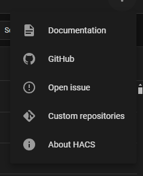
  </a>
</p>

- Copy the URL of this page and paste it into the "Repository URL" field and click "Add".

<p align="center">
  <a href="images/step1.1.png" target="_blank">
    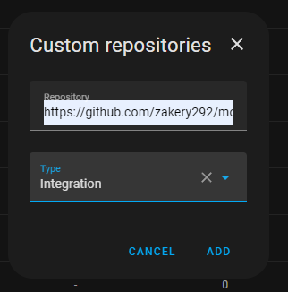
  </a>
</p>

- Once added, depending on how quickly you are, it will either be right there at the top of the list or you will need to search for it. Once found, click the three dots at the end of the row and select "Download".

<table align="center">
  <tr>
    <td>
      <a href="images/step1.3.png" target="_blank">
        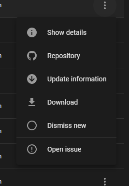
      </a>
    </td>
    <td>
      <a href="images/step1.4.png" target="_blank">
        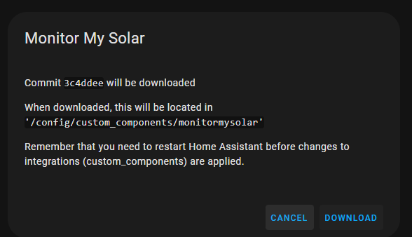
      </a>
    </td>
  </tr>
  <tr>
    <td><em>HACS integration download</em></td>
    <td><em>Download integration</em></td>
  </tr>
</table>

- Once downloaded, you will need to restart Home Assistant for the integration to be loaded.

<p align="center">
  <a href="images/step1.5.png" target="_blank">
    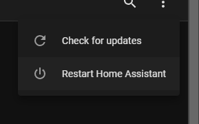
  </a>
</p>

## Step 2:

- Once Home Assistant has restarted, you will need to go to Settings -> Devices & Services -> Add Integration.

<p align="center">
  <a href="images/step2.png" target="_blank">
    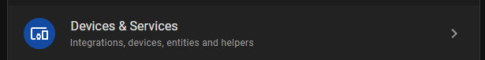
  </a>
  <a href="images/step2.1.png" target="_blank">
    
  </a>
</p>

- In the popup that appears, search for "Monitor My Solar" and click on the integration.

<p align="center">
  <a href="images/step2.2.png" target="_blank">
    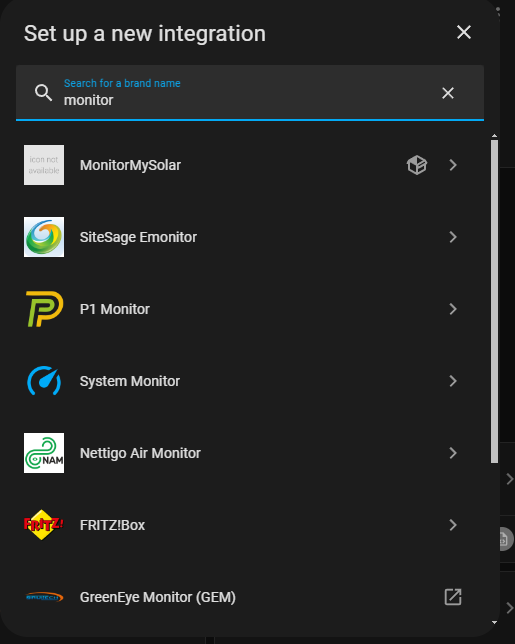
  </a>
</p>

- Before going any further, you will need the "dongle-ID". You can find this on the webpage that the dongle provides when you connect directly to it. If you know the IP address of your dongle, you should be able to put that in your browser to get to the dongle config page. Once on the dongle config page, we need to set up the Home Assistant MQTT Server settings.

<p align="center">
  <a href="images/step2.3.png" target="_blank">
    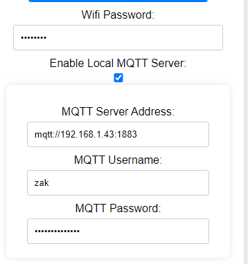
  </a>
</p>

- On the Dongle config page, click the box "Enable Local MQTT Server", fill out the MQTT Server Address as ```mqtt://<IP ADDRESS OF HOME ASSISTANT>:1883```, fill out the MQTT Server Username and MQTT Server Password with the credentials you set up in Home Assistant for Mosquitto (you can use your username and password although this is not recommended). Once done, click save. The dongle will restart. IF YOU DO NOT FOLLOW THIS STEP IT WILL NOT WORK AND YOU WILL NOT BE GIVEN ANY HELP. DONGLE SETUP FIRST BEFORE INTEGRATION SETUP.

<p align="center">
  <a href="images/step2.4.png" target="_blank">
    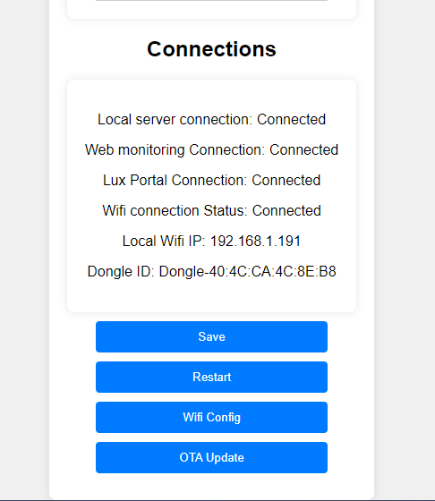
  </a>
</p>

- Dongle ID is presented at the bottom of the config page for Home Assistant. You will need to change the capitalization of Dongle to lowercase dongle.
- Once you have the Dongle-ID and you have set up the MQTT server on the dongle (you'll see connected on the webpage if it worked under Local MQTT Server), you can go back to Home Assistant and finish the integration setup.
- For the integration, select the inverter you're setting up. If you're using the Mosquitto broker, then leave the server as default, port as default, and enter the username and password you set up in Home Assistant for Mosquitto. Enter the Dongle-ID from the dongle config page. Press submit.

<p align="center">
  <a href="images/step2.5.png" target="_blank">
    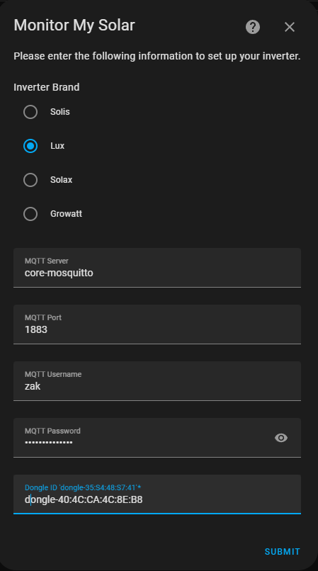
  </a>
</p>

## Step 3:

- If you followed these instructions and did not deviate, then you will be presented with a popup like the below image.

<p align="center">
  <a href="images/step3.png" target="_blank">
    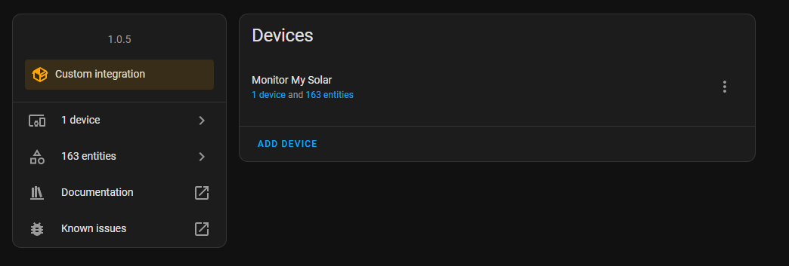
  </a>
</p>

- If you are presented with this popup, then you are complete.
- If you are not presented with this popup, then you have done something wrong and you will need to go back and check your work. If you are still stuck, please open an issue on the GitHub page and we will try to help you.

# FAQ

- **Q: Can I use an external MQTT broker?**
  - **A:** Yes, you can. For the Dongle, just put the IP address of the MQTT broker in the server address field and enter the username and password. In Home Assistant, you need to change core-mosquitto to the IP of the MQTT broker.
- **Q: It didn’t work?**
  - **A:** There is not much I can do for you. You need to check your work and make sure you have done everything correctly. If you are still stuck, please open an issue on the GitHub page and we will try to help you.
- **Q: It created the integration, told me to check the logs, and it said firmware response timeout.**
  - **A:** This is an issue with the dongle or Home Assistant not being connected to the broker. I suggest to help you debug the issue you download MQTTFX, connect to the broker and subscribe to the topic dongle-id/#, reboot the dongle, reboot Home Assistant, delete the integration, reinstall and try again. You should see a topic called dongle-id/firmware-request and then another with /firmware-response. If you see both of these, raise an issue and include pictures of the logs or the logs in general.
- **Q: I have a question that is not answered here.**
  - **A:** Please open an issue on the GitHub page and we will try to help you.


